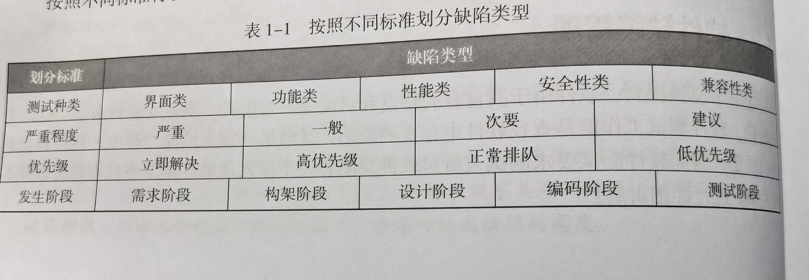
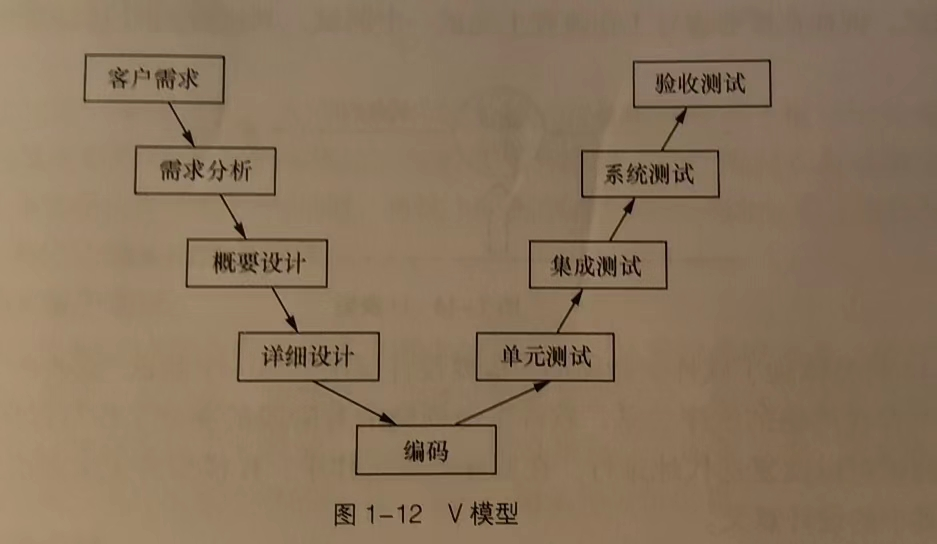
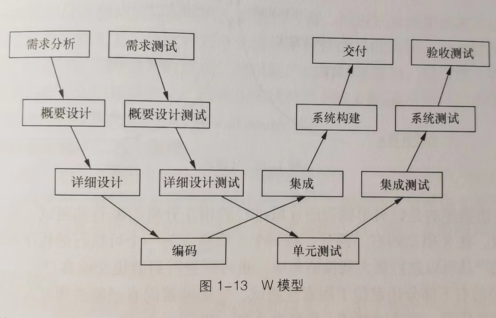
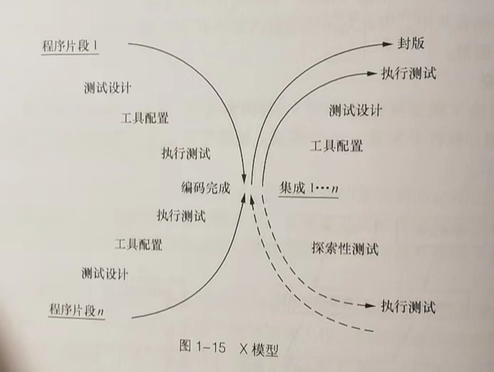

## 测试理论基础

### 一、软件基础

#### 1. 软件生命周期

问题定义->需求分析->软件设计->软件开发->软件测试->软件维护->淘汰

1-1.确定目标与可行性

1-2.划分需要实现的功能板块，后期需求可能会发生变化，应考虑到变化，保证项目顺利进行

1-3.对整个软件系统进行设计，如系统框架设计，数据库设计等

1-4.选择编程语言进行开发，有统一的符合标准的编写规范，保证程序可读性以及易维护性

1-5.查找软件设计与软件开发过程中存在的问题并加以修正，包括**单元测试、集成测试、系统测试**三个阶段，以**黑盒、白盒**两种方法相结合，减少随意性，制定详细的测试计划并严格遵守，完成后对测试结果分析并以文档方式汇总

#### 2. 软件开发模型

2-1.瀑布模型

2-2.快速原型模型

2-3.迭代模型

2-4.螺旋模型

2-5.敏捷模型（Scrum与Kanban开发模式）

#### 3. 软件质量

满足需求规定、满足用户需求、满足用户隐式需求

**易维护升级**（统一的符合标准的编码规范，清晰合理的代码注释，形成文档的需求分析，软件设计）

软件质量模型：


影响软件质量的因素：需求模糊、软件开发缺乏规范性文件指导、开发人员问题、缺乏质量控制管理

#### 4.软件缺陷

### 二、软件测试分类

#### 1.测试阶段

1-1.单元测试：验证单元是否符合需求与设计，大多是开发人员自测

1-2.冒烟测试：软件构建版本建立后对系统的基本功能进行简单的测试，重点验证主要功能

1-3.集成测试：单元组合后测试接口

1-4.系统测试：在实际环境中运行，与其他系统成分组合测试（数据库、硬件、操作人员）

1-5.验收测验：对软件产品说明进行验证，确保符合各项要求

#### 2.测试技术

2-1.黑盒测试：把软件（程序）当作一个有输入有输出的黑盒，输入数据能输出预期结果即可，不关心程序内部如何实现

2-2.白盒测试：把软件（程序）当作一个透明的盒子，测试人员了解软件程序的逻辑结构、路径与运行过程

黑盒与白盒区别：

黑盒：

- 外部逻辑功能缺陷，界面显示信息错误
- 兼容性错误，版本、运行环境等
- 性能问题，运行速度、响应时间等

白盒：

- 源程序多个分支
- 内存泄漏

使用情况：

| 测试名称 | 测试对象                         | 测试方法   |
| -------- | -------------------------------- | ---------- |
| 单元测试 | 模块功能（函数、类）             | 白盒       |
| 集成测试 | 接口测试（数据传递）             | 黑盒、白盒 |
| 系统测试 | 系统测试（软件、硬件）           | 黑盒       |
| 验收测试 | 系统测试（软件、硬件、用户体验） | 黑盒       |


#### 3.软件质量

3-1.功能测试：功能是否满足需求，包含准确性、易用性、适合性、互操作性等

3-2.性能测试：性能是否满足需求，包含负载测试、压力测试、兼容性测试、可移植性测试、健壮性测试等

#### 4.自动化程度

4-1.手工测试：一条一条代码执行

4-2.自动化测试：借助脚本、自动化测试工具等完成相应测试工作

#### 5.测试类型

5-1.界面类测试：界面布局是否美观，按钮是否齐全等

5-2.安全性测试：受到攻击或恶意破坏时如何处理，能否保证软件与数据的安全

5-3.文档测试：验证文档说明与实际软件之间是否存在差异，以需求分析、软件设计、用户手册、安装手册为主

#### 6.其它

α测试（最初版本测试）、β测试（上线后版本测试，debug）、回归测试（发现缺陷后返回给开发人员），随机测试（抽查）等

### 三、软件测试与软件开发

#### 1.各阶段作用

1-1.项目规划阶段：负责从单元测试到系统测试的整个测试阶段的监控

1-2.需求分析阶段：确定测试需求分析，确定项目中需要测试什么同时指定系统测试计划

1-3.概要设计与详细设计阶段：制定单元测试计划与集成测试计划

1-4.编码阶段：开发相应的测试代码和测试脚本

1-5.测试阶段：实时测试并提交相应的测试报告

#### 2.测试模型

2-1.V模型

2-2.W模型

2-3.H模型


2-4.X模型



#### 3.测试的原则

3-1.应基于客户需求

3-2.要尽早进行，贯彻在生命周期的各个阶段中

3-3.穷尽测试是不可能的

3-4.遵循GoodEnough，权衡投入与产出

3-5.符合二八定理，缺陷并不是平均分布，抓住主要矛盾，80%缺陷在20%模块中

3-6.避免缺陷免疫，不断修改和评审以及添加测试用例

#### 4.软件测试的流程

4-1.分析测试需求

4-2.制定测试计划：确定范围、制定策略、安排资源、安排进度、预估测试风险

##### **4-3.设计测试用例（Test Case）：**

**指的是一套详细的测试方案，包含测试环境、测试步骤、测试数据和预期结果。原则是尽量以最少的测试用例达到最大的测试覆盖率。常用的设计方法是等价类划分法、边界值分析法、因果图与判定法、正交实验设计法、逻辑覆盖法等**

**序号-需求-测试项目-用例题目-用例级别-测试点（测试输入）-预期结果**

**测试用例的级别**
**P1用例：系统的基本功能，用例数量应受到控制；划分依据：该用例执行失败，会导致多处重要功能不可用；发生概率较高的，经常使用的功能 ；该类用例需在每一轮版本测试中执行**
**P2用例：系统的重要功能，用例数量较多；划分依据：各种应用场景，使用频率较高的正常功能。功能交互相关；在系统测试版本中要执行，系统所有的重要功能都必须实现**
**P3用例：系统的一般功能，用例数量较多；划分依据：使用频率低于P2，比如不太常用的功能，边界值，事物完整性等；在集成测试阶段需要进行验证，在系统测试的中后期及回归测试中不一定每个版本都验证**
**P4用例：可有可无的用例；划分依据：比较生僻的输入，使用频率非常低得功能，和P1，P2的实现方式一样的（与P1、P2、P3重复的用例）；只用在集成测试阶段使用，在版本测试中，有某些正常原因，经过和项目经理进行沟通确认可以不执行**

4-4.执行测试：做好测试记录与跟踪，衡量缺陷的质量并写缺陷报告

##### 4-5.编写测试报告：

- 引言（目的，专业术语解釋，参考资料等）
- 测试概要（项目背景、测试时间、测试地点、测试人员等）
- 测试内容及执行情况（测试模块的版本、测试类型、使用的测试用例设计方法及测试通过覆盖率，给出测试执行活动的改进建议）
- 缺陷统计与分析（缺陷数目、类型等，分析原因，给出规避措施等建议，同时记录残留缺陷与为解决问题）
- 测试结论与建议（需求符合度、功能正确性、性能指标等多个维度对版本质量进行总评，给出具体明确结论）

### 四、黑盒测试

#### 1.等价划分法

1-1.划分等价类 

- 有效等价类：符合程序要求、合理且有意义的输入数据
- 无效等价类：无效值的集合
- 若为一个连续区间可分为一个有效等价类和两个无效等价类
- 若为一个必须成立的情况，如密码，则可分为一个有效等价类和一个无效等价类
- 若为一组可能的值，如数字开头的值，则可分为一个有效等价类和一个无效等价类
- 在某一个等价类中，每个输入数据在程序中处理方式不同，可分为更小的等价类，建立等价表
- 同一个等价类发现程序缺陷的能力相同
- 两个不同等价类不能当成一个，比如程序要输入1-100的整数，输入0.6，可能只会检测出非整数，而检测不出取值范围错误

1-2.测试用例设计

- 建立等价表
- 确定测试对象
- 为每一个等价类规定唯一编号
- 设计有效等价类的测试用例，使其尽可能多地覆盖尚未被覆盖的有效等价类，直到测试用例覆盖所有有效等价类
- 设计无效等价类的测试用例，使其覆盖所有的无效等价类

#### 2.边界值分析法

对输入或输出边界进行测试，缺乏充分性，只能作为等价类划分法的补充

#### 3.因果图与决策表法

1. 因果图

- 恒等
- 非
- 或
- 与
- E（异）：ab只能有一个1
- I（或）：abc必须有一个1
- O（唯一）：ab有且只有一个1
- R（要求）：ab相同
- M（强制）：输出条件ab不同

2. 因果图设计测试用例

- 确定输入与输出，即确定因果
- 分析输入与输入、输入与输出的关系，用因果图表示
- 有些组合不可能出现，用符号标记他们的限制或约束关系
- 将因果图转换成决策表
- 根据决策表设计测试用例
- 能发现规格说明书中的不完整性与二义性，帮助开发人员完善产品的规格说明

3. 决策表

- 每个原因（输入）用Y/N表示，得出结果，再经过简化，得出决策表

#### 4.正交实验设计法

大量实验点中挑出适量的、具有代表性的点

1. 3个关键因素

- 指标：判断实验结果优劣的标准
- 因子：因素，影响实验指标的条件
- 因子的状态：因子的水平，指因子变量的取值

2. 正交实验设计法设计测试用例

- 提取因子，构造因子状态表

| 因子     |         | 因子的状态 |        |
| -------- | ------- | ---------- | ------ |
| 操作系统 | Windows | Linux      | Mac    |
| 数据库   | MySQL   | MongoDB    | Oracle |

- 加权筛选，简化因子-状态表
- 构建正交表，设计测试用例，正交表表现形式为：Ln（下标）（tc（上标））
- L为正交表，n为行数（测试用例的数目），c为正交实验的因子数目（列数），t为水平数（每个因子能取得的最大值即多少个状态）

### 五、白盒测试

#### 1.逻辑覆盖法

1-1.语句覆盖：测试代码是否被执行，在多分支的程序中只能覆盖某一条路劲，无法全部覆盖

1-2.判定覆盖：分支覆盖，设计足够多的测试用例，保证每个判定至少有一次真值，有一次为假，确定真假分支均被执行，仍有单一性

1-3.条件覆盖：设计足够多的测试用例，使判定语句中的每个逻辑条件取真值与取假值至少出现一次

1-4.判定-条件覆盖：设计足够多的测试用例，使得判定语句中所有条件的可能取值至少出现一次，同时所有判定语句的可能结果也至少出现一次

1-5.条件组合覆盖：设计足够多的测试用例，使判定语句中每个条件的所有可能至少出现一次，并且判定语句中每个判定语句本身的判定结果也至少出现一次，不仅仅看“真假”

#### 2.程序插桩法

在测试程序中插入测试代码

2-1.目标代码插桩执行模式

- 即时模式（Just-In-Time）
- 解释模式（Interpretation Mode）
- 探测模式（Probe Mode）

2-2.目标代码插桩工具

- Pin
- DynamoRIO

2-3.源代码插桩（执行前）：有效提高代码测试覆盖率，但是带来代码膨胀、执行效率低下、HeisenBugs（莫名其妙出现莫名其妙消失的bug）

### 六、性能测试

用性能测试工具模拟正常、峰值及异常负载状态

1. 确定目的

- 验证系统性能是否满足预期的性能需求，包括执行效率、稳定性、可靠性、安全性等
- 分析软件系统在各种负在水平下的运动状态，提高性能和效率
- 识别系统缺陷，寻找系统中可能存在的性能问题，定位系统瓶颈并解决问题
- 系统调优，探测系统设计与资源之间的最佳平衡，改善并优化系统的性能

2. 性能测试的指标

- 响应时间：系统对用户请求做出响应的时间，包括中间服务器、数据库等处理时间
- 吞吐量：单位时间内系统能完成的工作量
- 并发用户数：同一时间请求和访问的用户数，数量大可能响应慢，系统不稳定
- TPS：每秒钟能处理的事务和交易的数量
- 点击率：每秒向web服务器提交的HTTP请求数量
- 资源利用率：软件对系统资源的使用情况，CPU利用率、内存利用率、磁盘利用率等

3. 性能测试的种类

- 负载测试：逐步增加系统负载，确定最终能承受的最大负载量，前提是满足性能指标要求
- 压力测试：强度测试，逐步增加压力(峰值测试直接将压力加到最大)，在某些资源达到饱和或系统崩溃边缘时，确定所能承受最大压力，压力测试是使性能达到极限的情况，可以揭露只有在高负载条件下才会出现的bug（缺陷），如同步问题、内存泄漏等
- 并发测试：模拟用户并发访问，可能又数据库访问错误、写入错误等异常状况
- 配置测试：调整软件系统的软硬件环境，如版本、cpu、内存等
- 可靠性测试：给系统加载一定的业务压力，使其运行一段时间（如7×24），有业务压力且时间较长的情况下检测内存泄漏等问题
- 容量测试：在一定软硬件及网络环境下，测试系统能支持的最大用户数、最大存储量等，通常与数据库、系统资源（CPU、内存）有关，用于规划将来的需求增长（用户、业务量等）

4. 性能测试的流程

- 分析性能测试需求
- 指定性能测试计划（确定环境、验收标准、测试场景、测试数据）
- 设计性能测试用例（同时访问数等）
- 编写性能测试脚本
- 测试执行与监控（查看性能指标变化、资源占用与释放情况、查看警告信息、日志检查）
- 运行结果分析
- 提交性能测试报告

5. 性能测试工具

5-1.LoadRunner

- VueGen
- Controller
- Analysis

5-2.JMeter

### 七、安全测试

（待肝）

### 八、自动化测试

大项目，长期，可重复利用的脚本

（待肝）


## c++性能测试

除了上面的性能测试基础外，针对c++性能测试的学习，主要初步了解了两个测试工具的使用

### 一、测试工具

1. gprof

   GNU profile,是GNU编译器工具包的一种性能分析工具，它能够准备的对函数调用的时间、次数以及相应关系进行描述和说明，还可以通过使用gprof2dot这个工具把结果直接展示为图形状态。它可以分为以下几步进行使用：
   1、在编译测试程序时打开编译开关 -pg
   2、运行程序并正常运行完成
   3、使用gprof命令来分析运行生成的gmon.out，生成性能测试结果的报告

```cpp
//testgprof.cpp
#include<iostream>

int main(void)
{
    std::cout << "start test------!" << std::endl;

    int64_t d = 0;

    for (int i = 0; i < 1000000000; i++)
    {
        d += i;
    }
    std::cout << "result is:" << d << std::endl;

    std::cout << "end test!" << std::endl;

    return 0;
}

//编译
g++  -pg testgprof.cpp  -o tgprof
//运行这个命令后可以在屏幕上看到相关的分析
gprof tgprof gmon.out


```

2. gperftool

   gperftools包括四个工具，即CPU profiler （CPU运行时间探测分析）、Heap Checker（内存检测） 、Heap Profiler（内存监控器） 及tcmalloc（内存管理库）。对CPU和内存泄露的检测一直是C\C++的一个痛点，Google提供这再从个方面的工具真是太及时了。
   这个软件需要安装下载，同样在编译时也要链接到相关的库，会在后面的文章中专门分析说明。需要说明的是在这个工具中提供了对不间断运行的应用程序（比如后台服务）的测试，可以通过信号指令来启动或者关闭相关的测试过程，如"kill -s SIGUSR1 进程ID".

```cpp
void TestLeakMem()
{
    int* p = new int[100];
    char* tmp = new char[100];

    delete[] p;
    //delete [] tmp;
}
int main(void)
{
    TestLeakMem();
    return 0;
}

//编译
g++ -O0 -g testmem.cpp -ltcmalloc -o testmem

```

参考：https://blog.csdn.net/fpcc/article/details/122391598?ops_request_misc=%257B%2522request%255Fid%2522%253A%2522166704846416782429730266%2522%252C%2522scm%2522%253A%252220140713.130102334.pc%255Fall.%2522%257D&request_id=166704846416782429730266&biz_id=0&utm_medium=distribute.pc_search_result.none-task-blog-2~all~first_rank_ecpm_v1~rank_v31_ecpm-2-122391598-null-null.142^v62^control,201^v3^add_ask,213^v1^control&utm_term=c%2B%2B%E6%80%A7%E8%83%BD%E6%B5%8B%E8%AF%95&spm=1018.2226.3001.4187

## GoogleTest单元测试框架

### 一、下载与安装

https://github.com/google/googletest

```shell
git clone https://github.com/google/googletest
cd googletest
mkdir build
cd build
cmake ..
make
sudo make install
```

### 二、基本特性
GoogleTest是一个google用于C/C++代码单元测试的框架
- ASSERT_* 系列的断言，当检查点失败时，退出当前函数（注意：并非退出当前案例）。 
- EXPECT_* 系列的断言，当检查点失败时，继续往下执行。
### 三、常用基本函数

### 四、举例介绍用法 
```cpp
    Test.cpp
     
    #include <iostream>
    #include <gtest/gtest.h>
     
    using namespace std;
     
     
    TEST(TestName, Subtest_1) {
        ASSERT_FALSE(1 == 2);
    }
     
    TEST(TestName, Subtest_2) {
        ASSERT_TRUE(1 == 2);
    }
     
     
    Int main(int argc, char **argv) {
         testing::InitGoogleTest(&argc, argv);
         return RUN_ALL_TESTS();
    }
```
上面是一个简单的判断真假的两个测试用例，在使用googletest的时候要引用gtest/gtest.h，在main函数中testing::InitGoogleTest是GoogleTest的一个全局方法，RUN_ALL_TESTS()是用来跑所有的测试用例的宏，返回0是全部用例pass，返回1说明用例有fail

### 五、测试用例
三步：
- Arrange--主要是一些初始化或者提供给测试用例的一些原始数据
- Act--主要是一些执行语句，算法之类的，得出一个结果
- Assert--主要是验证输出是否正确

三要素：
- Run extremely fast(within milliseconds)
- Must be able to run independently
- Doesn't depend upon any external input

### 六、Test Fixture
这个概念在任何xUnit系列的单元测试框架都会出现
一般指所有的测试用例都可以共享的步骤，例如初始化和事后清理操作，能提供这个功能的对象就是test fixture

用法：
单独写一个类并且继承testing::Test，如果有必要都需要实现SetUp()和TearDown()函数，至少有一个需要实现
- 在SetUp()函数中一般写一些初始化操作，例如测试对象的创建，对象的成员变量的初始化等，
- 在TearDown()一般用来集中清除资源操作，例如销毁在SetUp()中创建的被测试对象。
- **有点像构造函数和析构函数**

使用Test Fixture的代码：
```cpp
    class MyClass {
        int baseValue;
    public:
    	MyClass(int _bv) : baseValue(_bv) {}
    	void Increment(int byValue) {
    		baseValue += byValue;
    	}
    	Int getValue() {
    		return baseValue;
    	}
    };
     
    //继承testing::Test类
    Struct MyClassTest : public testing::Test {
    	MyClass *mc;
    	void SetUp() {
    		cout<<"test begin"<<endl;
    		mc = new MyClass(100); //所有用例可以共享
    	}
    	void TearDown() {
    		cout<<"test finish"<<endl;
    		delete mc;
    	}
    };
     
    TEST_F(MyClassTest , Increment_by_5) {
    	//Act
    	mc->Increment(5);
    	//Assert
    	ASSERT_EQ(mc->getValue(), 105);
    }
     
    TEST_F(MyClassTest , Increment_by_10) {
    	//Act
    	mc->Increment(10);
    	//Assert
    	ASSERT_EQ(mc->getValue(), 110);
    }
```
发现Arrange中的初始化语句被放到SetUp()中了,另外TEST(..)需要改成TEST_F(..),对象创建后要在TearDown()中把内存资源释放,SetUp和TearDown在每个用例执行都会跑一次

**模拟出栈测试**
```cpp
    Class Stack {
    	vector<int> vstack = {};
    public:
    	void push(int value) { 
    		vstack.push_back(value);
    	}
    	int pop() {
    		if (vstack.size() > 0) {
    			int value = vstack.back();
    			vstack.pop_back();
    			return value;
    		}else{
    			return -1;
    		}
    	}
    	int size() {
    		return vstack.size();
    	}
    };
     
    Struct stackTest : public testing::Test {
    	Stack s1;
    	void SetUp() {
    		int value[] = {1,2,3,4,5,6,7,8,9};
    		for (auto &val : value) {
    			s1.push(val);
    		}
    	}
    	void TearDown() {}
    };
     
    TEST_F(stackTest , PopTest) {
    	int lastPoppedValue = 9;
    	while(lastPoppedValue != 1) {
    		ASSERT_EQ(s1.pop(), lastPoppedValue--);
    	}
    }
     
    TEST_F(stackTest , PopTest) {
    	int lastPoppedValue = 10;
    	while(lastPoppedValue != 1) {
    		ASSERT_EQ(s1.pop(), lastPoppedValue--);
    	}
    }
     
    int main(int argc, char **argv) {
    	::testing::InitGoogleTest(&argc, argv);
    	return RUN_ALL_TESTS();
    }
```

### 七、断言
截取自：https://blog.csdn.net/king110108/article/details/126342844?spm=1001.2014.3001.5502

在gtest中有以下几种主要的断言形式：
1、布尔值断言

ASSERT_TRUE(condition);

EXPECT_TRUE(condition);

ASSERT_FALSE(condition);

EXPECT_FALSE(condition);

这个一看字面意思就明白，不作解释了。
2、数值断言

ASSERT_EQ(expected, actual);

EXPECT_EQ(expected, actual);

ASSERT_NE(val1, val2); EXPECT_NE(val1, val2);

ASSERT_LT(val1, val2); EXPECT_LT(val1, val2);

ASSERT_LE(val1, val2); EXPECT_LE(val1, val2);

ASSERT_GT(val1, val2); EXPECT_GT(val1, val2);

ASSERT_GE(val1, val2); EXPECT_GE(val1, val2);

这个如果学过汇编语言的可能一下子就明白了，其实后面的字符串就是比较的缩写，比如EQ是常见的等于；GT是大于，其它都类似。
3、字符串断言

ASSERT_STREQ(expected_str, actual_str);

EXPECT_STREQ(expected_str, actual_str);

ASSERT_STRNE(str1, str2);

EXPECT_STRNE(str1, str2);

ASSERT_STRCASEEQ(expected_str, actual_str);

EXPECT_STRCASEEQ(expected_str, actual_str);

ASSERT_STRCASENE(str1, str2);

EXPECT_STRCASENE(str1, str2);

其实和数值断言类似，只不过在字符串中可能存在大小写，所以要对这个进行处理一下。
4、结果断言

SUCCEED();FAIL(); ADD_FAILURE();
5、异常断言

ASSERT_THROW(statement, exception_type);

EXPECT_THROW(statement, exception_type);

ASSERT_ANY_THROW(statement);

EXPECT_ANY_THROW(statement);

ASSERT_NO_THROW(statement);

EXPECT_NO_THROW(statement);
6、谓词断言

ASSERT_PRED1(pred1, val1);

EXPECT_PRED1(pred1, val1);

ASSERT_PRED2(pred2, val1, val2);

EXPECT_PRED2(pred2, val1, val2);

ASSERT_PRED_FORMAT1(pred_format1, val1);

EXPECT_PRED_FORMAT1(pred_format1, val1);

ASSERT_PRED_FORMAT2(pred_format2, val1, val2);

EXPECT_PRED_FORMAT2(pred_format2, val1, val2);

这个要是搞过《离散数学》的可能就比较清楚，不过看过STL的源码的应该也好理解，其实就是有一个处理函数罢了。如果自己认为有更好的解决方式还可以自定义谓词。
7、浮点类型断言

ASSERT_FLOAT_EQ(expected, actual);

EXPECT_FLOAT_EQ(expected, actual);

ASSERT_DOUBLE_EQ(expected, actual);

EXPECT_DOUBLE_EQ(expected, actual);

ASSERT_NEAR(val1, val2, abs_error);

EXPECT_NEAR(val1, val2, abs_error);

这个没啥可更多解释的。
8、Windows平台的HRESULT断言

ASSERT_HRESULT_SUCCEEDED(expression);

EXPECT_HRESULT_SUCCEEDED(expression);

ASSERT_HRESULT_FAILED(expression);

EXPECT_HRESULT_FAILED(expression);
9、类型检查断言

这个有点类似于早期模板中的编译检查或者c++20后的概念Concepts，就是作一个类型的检测。

### 八、事件
gtest提供了多种事件机制，非常方便我们在案例之前或之后做一些操作。总结一下gtest的事件一共有3种：
1. 全局的，所有案例执行前后
2. TestSuite级别的，在某一批案例中第一个案例前，最后一个案例执行后
3. TestCase级别的，每个TestCase前后

**8-1.全局事件**
要实现全局事件，必须写一个类，继承testing::Environment类，实现里面的SetUp和TearDown方法。
1. SetUp()方法在所有案例执行前执行
2. TearDown()方法在所有案例执行后执行
3. 需要在main函数中通过testing::AddGlobalTestEnvironment方法将事件挂进来，也就是说，我们可以写很多个这样的类，然后将他们的事件都挂上去。

**8-2.TestSuite事件**
写一个类，继承testing::Test，然后实现两个静态方法
1. SetUpTestCase() 方法在第一个TestCase之前执行
2. TearDownTestCase() 方法在最后一个TestCase之后执行

**8-4.testCase事件**
TestCase事件是挂在每个案例执行前后的，实现方式和上面的几乎一样，不过需要实现的是SetUp方法和TearDown方法：
1. SetUp()方法在每个TestCase之前执行
2. TearDown()方法在每个TestCase之后执行

### 九、参数化

告诉gtest你的参数类型是什么

你必须添加一个类，继承`testing::TestWithParam<T>`，其中T就是你需要参数化的参数类型

告诉gtest你拿到参数的值后，具体做些什么样的测试

TEST_P，"P"可以理解为”parameterized" 或者 "pattern"。在TEST_P宏里，使用GetParam()获取当前的参数的具体值。

告诉gtest你想要测试的参数范围是什么

使用INSTANTIATE_TEST_CASE_P这宏来告诉gtest你要测试的参数范围：

```cpp
INSTANTIATE_TEST_CASE_P(TrueReturn, IsPrimeParamTest, testing::Values(3, 5, 11, 23, 17));
```

第一个参数是测试案例的前缀，可以任意取。

第二个参数是测试案例的名称，需要和之前定义的参数化的类的名称相同，如：IsPrimeParamTest

第三个参数是可以理解为参数生成器，上面的例子使用test::Values表示使用括号内的参数。

Google提供了一系列的参数生成的函数：

| `Range(begin, end[, step])`                      | 范围在begin~end之间，步长为step，不包括end                   |
| ------------------------------------------------ | ------------------------------------------------------------ |
| `Values(v1, v2, ..., vN)`                        | v1,v2到vN的值                                                |
| `ValuesIn(container)` and `ValuesIn(begin, end)` | 从一个C类型的数组或是STL容器，或是迭代器中取值               |
| `Bool()`                                         | 取`false 和 true 两个值`                                     |
| `Combine(g1, g2, ..., gN)`                       | 这个比较强悍，它将g1,g2,...gN进行排列组合，g1,g2,...gN本身是一个参数生成器，每次分别从g1,g2,..gN中各取出一个值，组合成一个元组(Tuple)作为一个参数。说明：这个功能只在提供了`<tr1/tuple>头的系统中有效。gtest会自动去判断是否支持tr/tuple，如果你的系统确实支持，而`gtest判断错误的话，你可以重新定义宏`GTEST_HAS_TR1_TUPLE=1`。 |

此外还可以类型参数化

### 十、死亡测试

**10-1.使用的宏** 

| **Fatal assertion**                            | **Nonfatal assertion**                         | **Verifies**                                                 |
| ---------------------------------------------- | ---------------------------------------------- | ------------------------------------------------------------ |
| `ASSERT_DEATH(`*statement, regex*`);           | `EXPECT_DEATH(`*statement, regex*`);           | *statement* crashes with the given error                     |
| `ASSERT_EXIT(`*statement, predicate, regex*`); | `EXPECT_EXIT(`*statement, predicate, regex*`); | *statement* exits with the given error and its exit code matches *predicate* |

由于有些异常只在Debug下抛出，因此还提供了*_DEBUG_DEATH，用来处理Debug和Realease下的不同。

 **10-2.*_DEATH(statement, regex`)** 

1. statement是被测试的代码语句

2. regex是一个正则表达式，用来匹配异常时在stderr中输出的内容

3. **编写死亡测试案例时，TEST的第一个参数，即testcase_name，请使用DeathTest后缀。原因是gtest会优先运行死亡测试案例，应该是为线程安全考虑。**

**10-3.**_`EXIT(`*statement, predicate, regex`)**

1. statement是被测试的代码语句

2. predicate 在这里必须是一个委托，接收int型参数，并返回bool。只有当返回值为true时，死亡测试案例才算通过。gtest提供了一些常用的predicate：

```c++
testing::ExitedWithCode(exit_code)
//如果程序正常退出并且退出码与exit_code相同则返回 `true`
testing::KilledBySignal(signal_number) // Windows下不支持
//如果程序被signal_number信号kill的话就返回true
```

3. regex是一个正则表达式(**POSIX风格**)，用来匹配异常时在stderr中输出的内容

\*\_DEATH其实是对\*\_EXIT进行的一次包装，*_DEATH的predicate判断进程是否以非0退出码退出或被一个信号杀死。

**10-4.*_DEBUG_DEATH**

```cpp
int DieInDebugElse12(int* sideeffect) {
    if (sideeffect) *sideeffect = 12;
#ifndef NDEBUG
    GTEST_LOG_(FATAL, "debug death inside DieInDebugElse12()");
#endif  // NDEBUG
    return 12;
}
TEST(TestCase, TestDieOr12WorksInDgbAndOpt)
{
    int sideeffect = 0;
    // Only asserts in dbg.
    EXPECT_DEBUG_DEATH(DieInDebugElse12(&sideeffect), "death");

    #ifdef NDEBUG
    // opt-mode has sideeffect visible.
    EXPECT_EQ(12, sideeffect);
    #else
    // dbg-mode no visible sideeffect.
    EXPECT_EQ(0, sideeffect);
    #endif
}
```

**死亡测试运行方式**

1. fast方式（默认的方式）

testing::FLAGS_gtest_death_test_style = "fast";

2. threadsafe方式

testing::FLAGS_gtest_death_test_style = "threadsafe";

**注意事项**

1. 不要在死亡测试里释放内存。

2. 在父进程里再次释放内存。

3. 不要在程序中使用内存堆检查。

### 十一、运行参数

最后再来说下第一种设置方式-系统环境变量。如果需要gtest的设置系统环境变量，必须注意的是：

1. 系统环境变量全大写，比如对于--gtest_output，响应的系统环境变量为：GTEST_OUTPUT

2. 有一个命令行参数例外，那就是--gtest_list_tests，它是不接受系统环境变量的。（只是用来罗列测试案例名称）

参数列表： 

了解了上面的内容，我这里就直接将所有命令行参数总结和罗列一下。如果想要获得详细的命令行说明，直接运行你的案例，输入命令行参数：/? 或 --help 或 -help

1. 测试案例集合

| **命令行参数**                  | **说明**                                                     |
| ------------------------------- | ------------------------------------------------------------ |
| --gtest_list_tests              | 使用这个参数时，将不会执行里面的测试案例，而是输出一个案例的列表。 |
| --gtest_filter                  | 对执行的测试案例进行过滤，支持通配符?  单个字符*  任意字符-   排除，如，-a 表示除了a :  取或，如，a:b 表示a或b 比如下面的例子：./foo_test 没有指定过滤条件，运行所有案例 ./foo_test --gtest_filter=* 使用通配符*，表示运行所有案例 ./foo_test --gtest_filter=FooTest.* 运行所有“测试案例名称(testcase_name)”为FooTest的案例 ./foo_test --gtest_filter=*Null*:*Constructor* 运行所有“测试案例名称(testcase_name)”或“测试名称(test_name)”包含Null或Constructor的案例。 ./foo_test --gtest_filter=-*DeathTest.* 运行所有非死亡测试案例。 ./foo_test --gtest_filter=FooTest.*-FooTest.Bar 运行所有“测试案例名称(testcase_name)”为FooTest的案例，但是除了FooTest.Bar这个案例 |
| --gtest_also_run_disabled_tests | 执行案例时，同时也执行被置为无效的测试案例。关于设置测试案例无效的方法为：在测试案例名称或测试名称中添加DISABLED前缀，比如：[](javascript:void(0);)// Tests that Foo does Abc. TEST(FooTest, DISABLED_DoesAbc) {  }  class DISABLED_BarTest : public testing::Test {  };  // Tests that Bar does Xyz. TEST_F(DISABLED_BarTest, DoesXyz) {  }[](javascript:void(0);) |
| --gtest_repeat=[COUNT]          | 设置案例重复运行次数，非常棒的功能！比如：--gtest_repeat=1000    重复执行1000次，即使中途出现错误。 --gtest_repeat=-1      无限次数执行。。。。 --gtest_repeat=1000 --gtest_break_on_failure   重复执行1000次，并且在第一个错误发生时立即停止。这个功能对调试非常有用。 --gtest_repeat=1000 --gtest_filter=FooBar   重复执行1000次测试案例名称为FooBar的案例。 |

2. 测试案例输出

| **命令行参数**                                  | **说明**                                                     |
| ----------------------------------------------- | ------------------------------------------------------------ |
| --gtest_color=(yes\|no\|auto)                   | 输出命令行时是否使用一些五颜六色的颜色。默认是auto。         |
| --gtest_print_time                              | 输出命令行时是否打印每个测试案例的执行时间。默认是不打印的。 |
| --gtest_output=xml[:DIRECTORY_PATH\|:FILE_PATH] | 将测试结果输出到一个xml中。1.--gtest_output=xml:   不指定输出路径时，默认为案例当前路径。 2.--gtest_output=xml:d:\ 指定输出到某个目录 3.--gtest_output=xml:d:\foo.xml 指定输出到d:\foo.xml 如果不是指定了特定的文件路径，gtest每次输出的报告不会覆盖，而会以数字后缀的方式创建。xml的输出内容后面介绍吧。 |

3. 对案例的异常处理

| **命令行参数**           | **说明**                                                     |
| ------------------------ | ------------------------------------------------------------ |
| --gtest_break_on_failure | 调试模式下，当案例失败时停止，方便调试                       |
| --gtest_throw_on_failure | 当案例失败时以C++异常的方式抛出                              |
| --gtest_catch_exceptions | 是否捕捉异常。gtest默认是不捕捉异常的，因此假如你的测试案例抛了一个异常，很可能会弹出一个对话框，这非常的不友好，同时也阻碍了测试案例的运行。如果想不弹这个框，可以通过设置这个参数来实现。如将--gtest_catch_exceptions设置为一个非零的数。注意：这个参数只在Windows下有效。 |

一些参考https://www.cnblogs.com/coderzh/archive/2009/04/06/1426755.html
