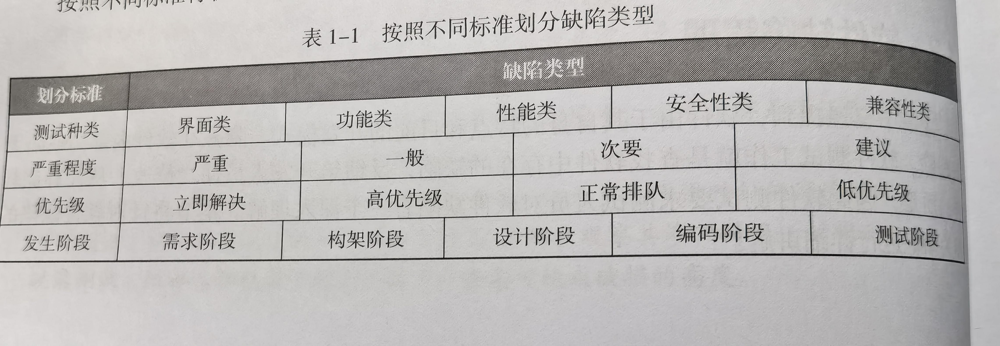
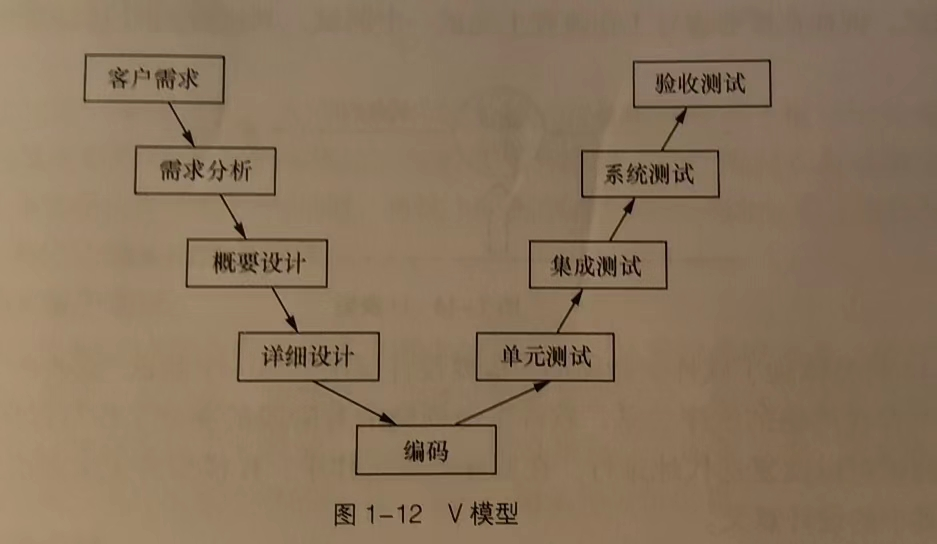
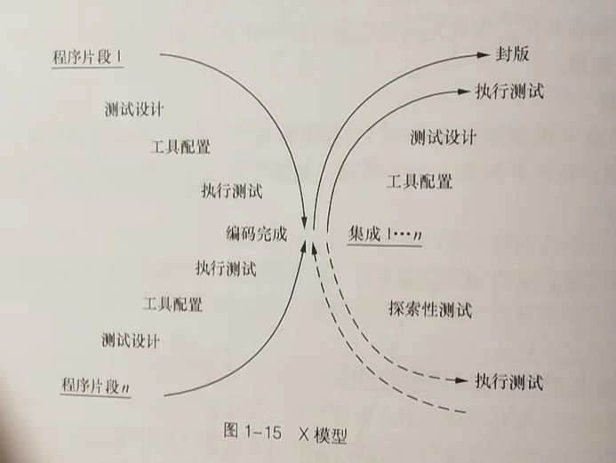

## 测试理论基础

### 一、软件基础

#### 1. 软件生命周期

问题定义->需求分析->软件设计->软件开发->软件测试->软件维护->淘汰

1-1.确定目标与可行性

1-2.划分需要实现的功能板块，后期需求可能会发生变化，应考虑到变化，保证项目顺利进行

1-3.对整个软件系统进行设计，如系统框架设计，数据库设计等

1-4.选择编程语言进行开发，有统一的符合标准的编写规范，保证程序可读性以及易维护性

1-5.查找软件设计与软件开发过程中存在的问题并加以修正，包括**单元测试、集成测试、系统测试**三个阶段，以**黑盒、白盒**两种方法相结合，减少随意性，制定详细的测试计划并严格遵守，完成后对测试结果分析并以文档方式汇总

#### 2. 软件开发模型

2-1.瀑布模型

2-2.快速原型模型

2-3.迭代模型

2-4.螺旋模型

2-5.敏捷模型（Scrum与Kanban开发模式）

#### 3. 软件质量

满足需求规定、满足用户需求、满足用户隐式需求

**易维护升级**（统一的符合标准的编码规范，清晰合理的代码注释，形成文档的需求分析，软件设计）

软件质量模型：


影响软件质量的因素：需求模糊、软件开发缺乏规范性文件指导、开发人员问题、缺乏质量控制管理

#### 4.软件缺陷

### 二、软件测试分类

#### 1.测试阶段

1-1.单元测试：验证单元是否符合需求与设计，大多是开发人员自测

1-2.冒烟测试：软件构建版本建立后对系统的基本功能进行简单的测试，重点验证主要功能

1-3.集成测试：单元组合后测试接口

1-4.系统测试：在实际环境中运行，与其他系统成分组合测试（数据库、硬件、操作人员）

1-5.验收测验：对软件产品说明进行验证，确保符合各项要求

#### 2.测试技术

2-1.黑盒测试：把软件（程序）当作一个有输入有输出的黑盒，输入数据能输出预期结果即可，不关心程序内部如何实现

2-2.白盒测试：把软件（程序）当作一个透明的盒子，测试人员了解软件程序的逻辑结构、路径与运行过程

黑盒与白盒区别：

黑盒：

- 外部逻辑功能缺陷，界面显示信息错误
- 兼容性错误，版本、运行环境等
- 性能问题，运行速度、响应时间等

白盒：

- 源程序多个分支
- 内存泄漏

使用情况：

| 测试名称 | 测试对象                         | 测试方法   |
| -------- | -------------------------------- | ---------- |
| 单元测试 | 模块功能（函数、类）             | 白盒       |
| 集成测试 | 接口测试（数据传递）             | 黑盒、白盒 |
| 系统测试 | 系统测试（软件、硬件）           | 黑盒       |
| 验收测试 | 系统测试（软件、硬件、用户体验） | 黑盒       |


#### 3.软件质量

3-1.功能测试：功能是否满足需求，包含准确性、易用性、适合性、互操作性等

3-2.性能测试：性能是否满足需求，包含负载测试、压力测试、兼容性测试、可移植性测试、健壮性测试等

#### 4.自动化程度

4-1.手工测试：一条一条代码执行

4-2.自动化测试：借助脚本、自动化测试工具等完成相应测试工作

#### 5.测试类型

5-1.界面类测试：界面布局是否美观，按钮是否齐全等

5-2.安全性测试：受到攻击或恶意破坏时如何处理，能否保证软件与数据的安全

5-3.文档测试：验证文档说明与实际软件之间是否存在差异，以需求分析、软件设计、用户手册、安装手册为主

#### 6.其它

α测试（最初版本测试）、β测试（上线后版本测试，debug）、回归测试（发现缺陷后返回给开发人员），随机测试（抽查）等

### 三、软件测试与软件开发

#### 1.各阶段作用

1-1.项目规划阶段：负责从单元测试到系统测试的整个测试阶段的监控

1-2.需求分析阶段：确定测试需求分析，确定项目中需要测试什么同时指定系统测试计划

1-3.概要设计与详细设计阶段：制定单元测试计划与集成测试计划

1-4.编码阶段：开发相应的测试代码和测试脚本

1-5.测试阶段：实时测试并提交相应的测试报告

#### 2.测试模型

2-1.V模型

2-2.W模型

2-3.H模型


2-4.X模型



#### 3.测试的原则

3-1.应基于客户需求

3-2.要尽早进行，贯彻在生命周期的各个阶段中

3-3.穷尽测试是不可能的

3-4.遵循GoodEnough，权衡投入与产出

3-5.符合二八定理，缺陷并不是平均分布，抓住主要矛盾，80%缺陷在20%模块中

3-6.避免缺陷免疫，不断修改和评审以及添加测试用例

#### 4.软件测试的流程

4-1.分析测试需求

4-2.制定测试计划：确定范围、制定策略、安排资源、安排进度、预估测试风险

##### **4-3.设计测试用例（Test Case）：**

**指的是一套详细的测试方案，包含测试环境、测试步骤、测试数据和预期结果。原则是尽量以最少的测试用例达到最大的测试覆盖率。常用的设计方法是等价类划分法、边界值分析法、因果图与判定法、正交实验设计法、逻辑覆盖法等**

**序号-需求-测试项目-用例题目-用例级别-测试点（测试输入）-预期结果**

**测试用例的级别**
**P1用例：系统的基本功能，用例数量应受到控制；划分依据：该用例执行失败，会导致多处重要功能不可用；发生概率较高的，经常使用的功能 ；该类用例需在每一轮版本测试中执行**
**P2用例：系统的重要功能，用例数量较多；划分依据：各种应用场景，使用频率较高的正常功能。功能交互相关；在系统测试版本中要执行，系统所有的重要功能都必须实现**
**P3用例：系统的一般功能，用例数量较多；划分依据：使用频率低于P2，比如不太常用的功能，边界值，事物完整性等；在集成测试阶段需要进行验证，在系统测试的中后期及回归测试中不一定每个版本都验证**
**P4用例：可有可无的用例；划分依据：比较生僻的输入，使用频率非常低得功能，和P1，P2的实现方式一样的（与P1、P2、P3重复的用例）；只用在集成测试阶段使用，在版本测试中，有某些正常原因，经过和项目经理进行沟通确认可以不执行**

4-4.执行测试：做好测试记录与跟踪，衡量缺陷的质量并写缺陷报告

##### 4-5.编写测试报告：

- 引言（目的，专业术语解釋，参考资料等）
- 测试概要（项目背景、测试时间、测试地点、测试人员等）
- 测试内容及执行情况（测试模块的版本、测试类型、使用的测试用例设计方法及测试通过覆盖率，给出测试执行活动的改进建议）
- 缺陷统计与分析（缺陷数目、类型等，分析原因，给出规避措施等建议，同时记录残留缺陷与为解决问题）
- 测试结论与建议（需求符合度、功能正确性、性能指标等多个维度对版本质量进行总评，给出具体明确结论）

### 四、黑盒测试

#### 1.等价划分法

1-1.划分等价类 

- 有效等价类：符合程序要求、合理且有意义的输入数据
- 无效等价类：无效值的集合
- 若为一个连续区间可分为一个有效等价类和两个无效等价类
- 若为一个必须成立的情况，如密码，则可分为一个有效等价类和一个无效等价类
- 若为一组可能的值，如数字开头的值，则可分为一个有效等价类和一个无效等价类
- 在某一个等价类中，每个输入数据在程序中处理方式不同，可分为更小的等价类，建立等价表
- 同一个等价类发现程序缺陷的能力相同
- 两个不同等价类不能当成一个，比如程序要输入1-100的整数，输入0.6，可能只会检测出非整数，而检测不出取值范围错误

1-2.测试用例设计

- 建立等价表
- 确定测试对象
- 为每一个等价类规定唯一编号
- 设计有效等价类的测试用例，使其尽可能多地覆盖尚未被覆盖的有效等价类，直到测试用例覆盖所有有效等价类
- 设计无效等价类的测试用例，使其覆盖所有的无效等价类

#### 2.边界值分析法

对输入或输出边界进行测试，缺乏充分性，只能作为等价类划分法的补充

#### 3.因果图与决策表法

1. 因果图

- 恒等
- 非
- 或
- 与
- E（异）：ab只能有一个1
- I（或）：abc必须有一个1
- O（唯一）：ab有且只有一个1
- R（要求）：ab相同
- M（强制）：输出条件ab不同

2. 因果图设计测试用例

- 确定输入与输出，即确定因果
- 分析输入与输入、输入与输出的关系，用因果图表示
- 有些组合不可能出现，用符号标记他们的限制或约束关系
- 将因果图转换成决策表
- 根据决策表设计测试用例
- 能发现规格说明书中的不完整性与二义性，帮助开发人员完善产品的规格说明

3. 决策表

- 每个原因（输入）用Y/N表示，得出结果，再经过简化，得出决策表

#### 4.正交实验设计法

大量实验点中挑出适量的、具有代表性的点

1. 3个关键因素

- 指标：判断实验结果优劣的标准
- 因子：因素，影响实验指标的条件
- 因子的状态：因子的水平，指因子变量的取值

2. 正交实验设计法设计测试用例

- 提取因子，构造因子状态表

| 因子     |         | 因子的状态 |        |
| -------- | ------- | ---------- | ------ |
| 操作系统 | Windows | Linux      | Mac    |
| 数据库   | MySQL   | MongoDB    | Oracle |

- 加权筛选，简化因子-状态表
- 构建正交表，设计测试用例，正交表表现形式为：Ln（下标）（tc（上标））
- L为正交表，n为行数（测试用例的数目），c为正交实验的因子数目（列数），t为水平数（每个因子能取得的最大值即多少个状态）

### 五、白盒测试

#### 1.逻辑覆盖法

1-1.语句覆盖：测试代码是否被执行，在多分支的程序中只能覆盖某一条路劲，无法全部覆盖

1-2.判定覆盖：分支覆盖，设计足够多的测试用例，保证每个判定至少有一次真值，有一次为假，确定真假分支均被执行，仍有单一性

1-3.条件覆盖：设计足够多的测试用例，使判定语句中的每个逻辑条件取真值与取假值至少出现一次

1-4.判定-条件覆盖：设计足够多的测试用例，使得判定语句中所有条件的可能取值至少出现一次，同时所有判定语句的可能结果也至少出现一次

1-5.条件组合覆盖：设计足够多的测试用例，使判定语句中每个条件的所有可能至少出现一次，并且判定语句中每个判定语句本身的判定结果也至少出现一次，不仅仅看“真假”

#### 2.程序插桩法

在测试程序中插入测试代码

2-1.目标代码插桩执行模式

- 即时模式（Just-In-Time）
- 解释模式（Interpretation Mode）
- 探测模式（Probe Mode）

2-2.目标代码插桩工具

- Pin
- DynamoRIO

2-3.源代码插桩（执行前）：有效提高代码测试覆盖率，但是带来代码膨胀、执行效率低下、HeisenBugs（莫名其妙出现莫名其妙消失的bug）

### 六、性能测试

用性能测试工具模拟正常、峰值及异常负载状态

1. 确定目的

- 验证系统性能是否满足预期的性能需求，包括执行效率、稳定性、可靠性、安全性等
- 分析软件系统在各种负在水平下的运动状态，提高性能和效率
- 识别系统缺陷，寻找系统中可能存在的性能问题，定位系统瓶颈并解决问题
- 系统调优，探测系统设计与资源之间的最佳平衡，改善并优化系统的性能

2. 性能测试的指标

- 响应时间：系统对用户请求做出响应的时间，包括中间服务器、数据库等处理时间
- 吞吐量：单位时间内系统能完成的工作量
- 并发用户数：同一时间请求和访问的用户数，数量大可能响应慢，系统不稳定
- TPS：每秒钟能处理的事务和交易的数量
- 点击率：每秒向web服务器提交的HTTP请求数量
- 资源利用率：软件对系统资源的使用情况，CPU利用率、内存利用率、磁盘利用率等

3. 性能测试的种类

- 负载测试：逐步增加系统负载，确定最终能承受的最大负载量，前提是满足性能指标要求
- 压力测试：强度测试，逐步增加压力(峰值测试直接将压力加到最大)，在某些资源达到饱和或系统崩溃边缘时，确定所能承受最大压力，压力测试是使性能达到极限的情况，可以揭露只有在高负载条件下才会出现的bug（缺陷），如同步问题、内存泄漏等
- 并发测试：模拟用户并发访问，可能又数据库访问错误、写入错误等异常状况
- 配置测试：调整软件系统的软硬件环境，如版本、cpu、内存等
- 可靠性测试：给系统加载一定的业务压力，使其运行一段时间（如7×24），有业务压力且时间较长的情况下检测内存泄漏等问题
- 容量测试：在一定软硬件及网络环境下，测试系统能支持的最大用户数、最大存储量等，通常与数据库、系统资源（CPU、内存）有关，用于规划将来的需求增长（用户、业务量等）

4. 性能测试的流程

- 分析性能测试需求
- 指定性能测试计划（确定环境、验收标准、测试场景、测试数据）
- 设计性能测试用例（同时访问数等）
- 编写性能测试脚本
- 测试执行与监控（查看性能指标变化、资源占用与释放情况、查看警告信息、日志检查）
- 运行结果分析
- 提交性能测试报告

5. 性能测试工具

5-1.LoadRunner

- VueGen
- Controller
- Analysis

5-2.JMeter

### 七、安全测试

（待肝）

### 八、自动化测试

大项目，长期，可重复利用的脚本

（待肝）

## GoogleTest单元测试框架

### 一、下载与安装

https://github.com/google/googletest

进入googletest的目录

```shell
cmake CMakeLists.txt
#若报错在CMakeLists添加
set(GOOGLETEST_VERSION 1.11.0)
##################################
make
```

将lib目录下的静态库和include头文件拷贝到系统目录下